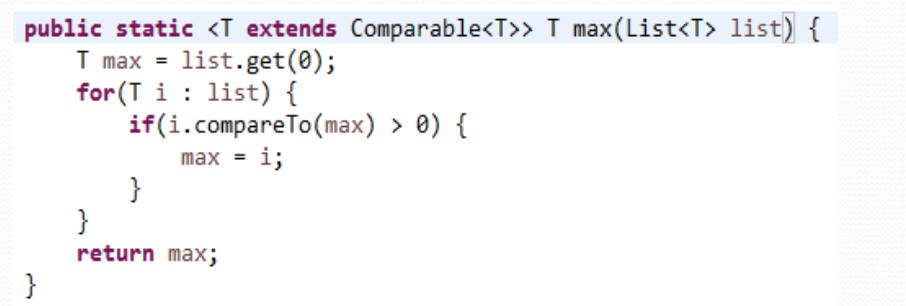
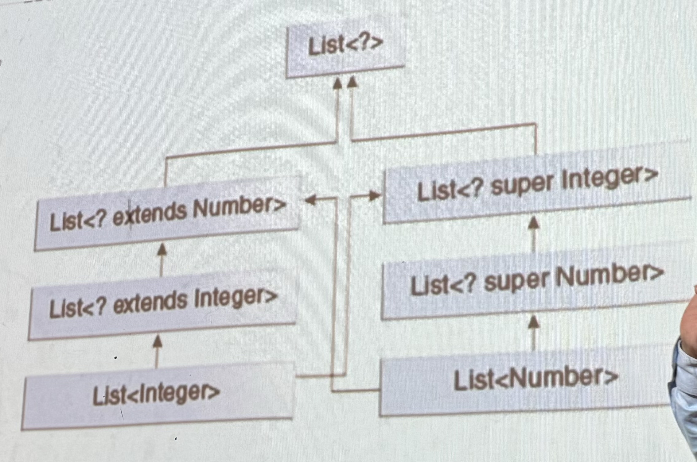

## Note 1
this extends is not the normal extend where it inherit the class, this extend accept both interface and class 

## Note 2
extend wildcard can get but cannot add, cannot create new object of a generic type ,because the compiler needs the type in advance.
Super wildecard can add but cannot get

unbounded wildcard <?> is the same as <? extends object>

## Note 3
Soltion Lab 11 will come in the final

solve this it will come in the exam
Draw a class diagram showing the inheritance relationships among the following types:
List<Integer>
List<Number>
List<? extends Integer>
List<? extends Number› 
List‹? super Integer›
List<? super Number>
List<?>
List<Object›
List<Double>
List<? extends Double>
List<? extends Double>
