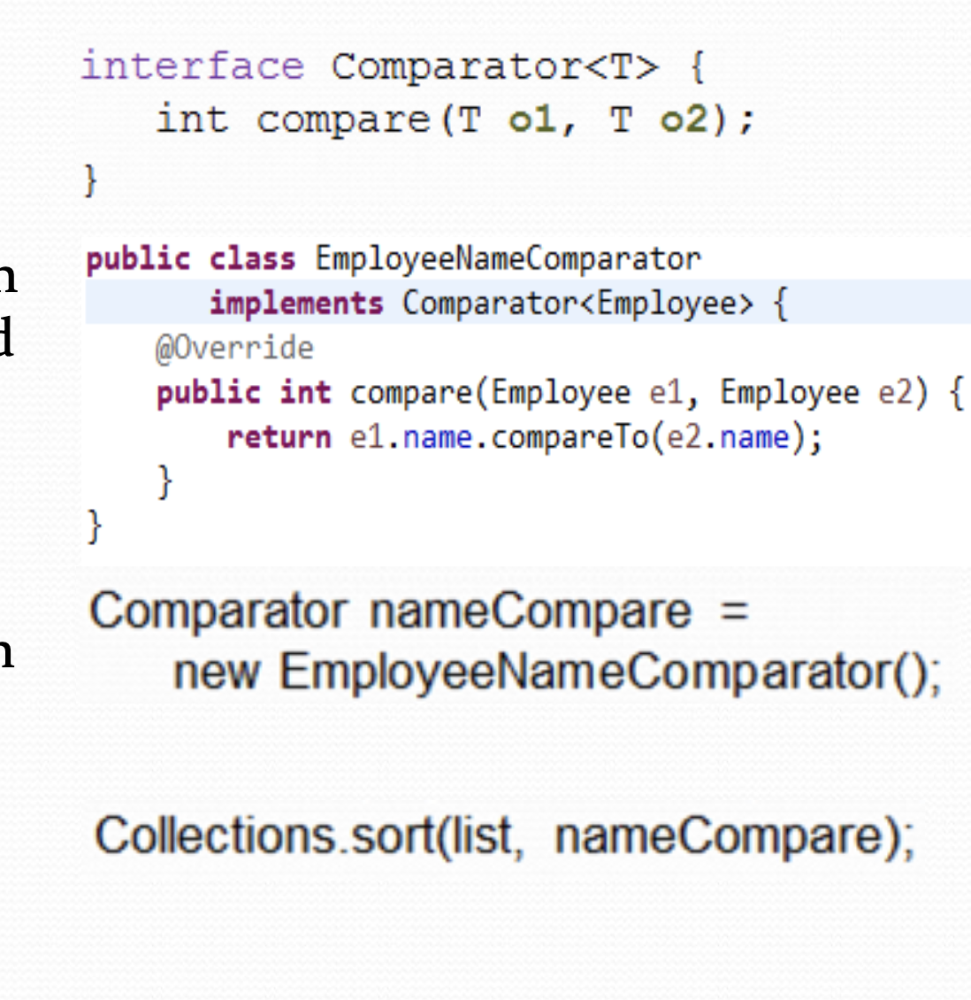
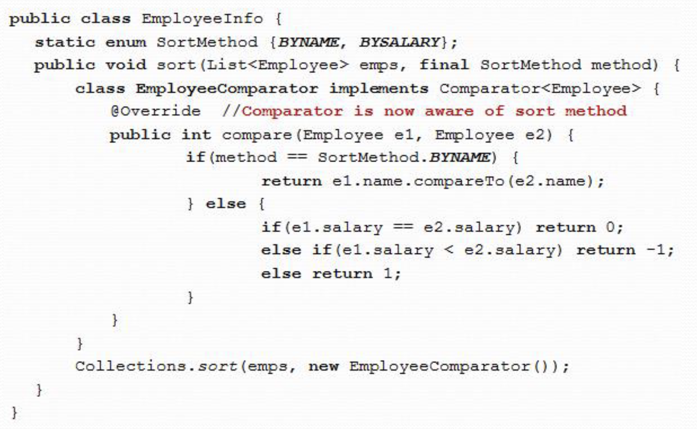
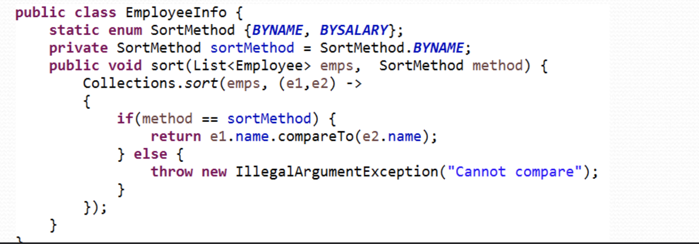
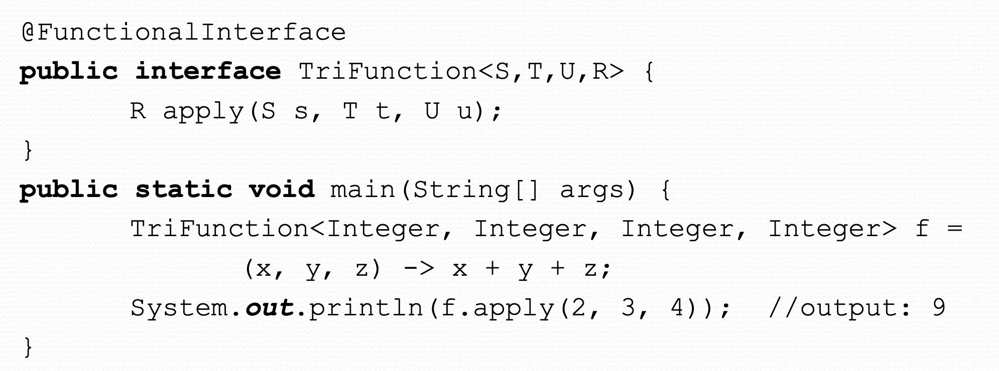
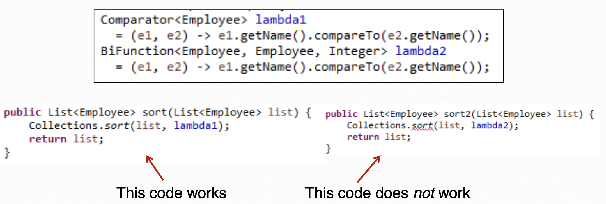

# Lesson 8 Notes

## Note 1
in java you cannot pass a function to another funtion as a parameter
ex.
void fun1(int x) {}
void fun2(int x){}
void fun3(fun1) -> this is not acciptible in java.

this is called first-class citizen concept.

## Note 2
Functional interface is an interface that has only one abstract method, you can have multiple default methods but it should have only one abstract method.
when you implement this interface, the implementor class when you create an object of it, you can pass it as a prarmeter and the method that recives it it will automatically call this abstract method.

## Note 3
The inner class can access the parameters from the function, the variables in the function scope and the main class attributes, parameter and local scope are final and cannot be changed by the inner class but it could change the attributes.

You can apply the same thing using lambda 

## Note 4
You can create your own functional interface like this

## Note 5
You can re-use the lambda expression by storing it in a variable, but you need to be careful when definding the type of the lambda, below is example of this case
