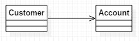
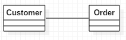
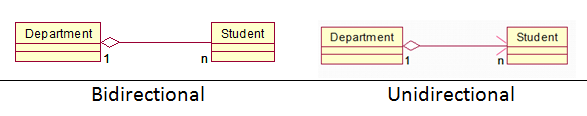
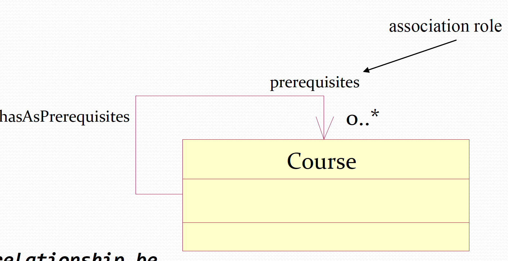
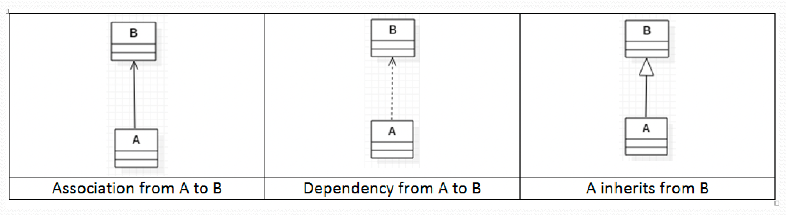
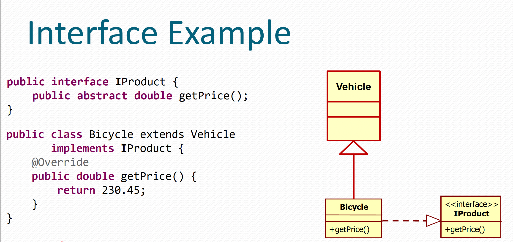
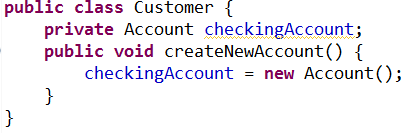
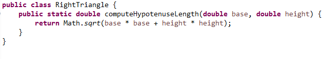

# UML Diagrams

## Use case diagram
1. determine the actors of the system
2. determine the Use cases of the system
3. determine what use cases each actor will perform
4. draw the actor -> system (use cases) -> arrows from the actors to the use cases

## Class diagram
class name, attributes and methods 
## Sequence diagrams

## Types of relationships between classes: association:
1. Unidirectional associations

2. bidirectional associations

3. Association Multiplicities, UML supports a variety of multiplicities:
    - 1 one (mandatory)
    - 3 three (exactly)
    - * many
    - 0..* zero or more (optional)
    - 1..* one or more
    - 0..1 zero or one (optional)

4. Aggregation
5. Composition
6. Reflexive associations

7. Dependency:
    Is a temporory relation, the class uses another class without maintaining the object
## Associations diagrams

## Associations
1. Customer has an Account
2. Permanent relationship
3. Association from A to B implies A keeps a reference to B
4. Association from A to B implies it is possible to navigate from A to B at runtime

## Dependencies
1. RightTriangle uses Math (see example)
2. Temporary relationship
3. Dependency from A to B implies A does not keep a reference to B
